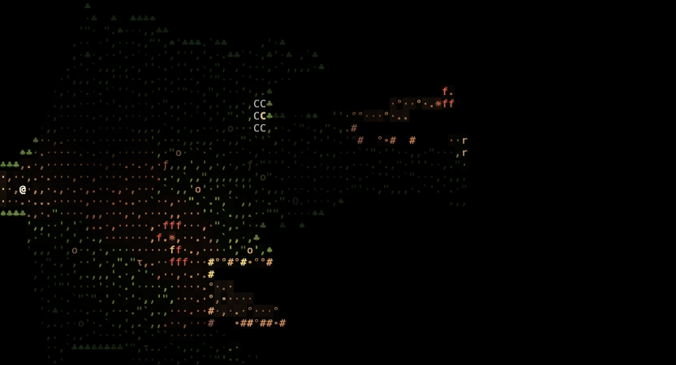
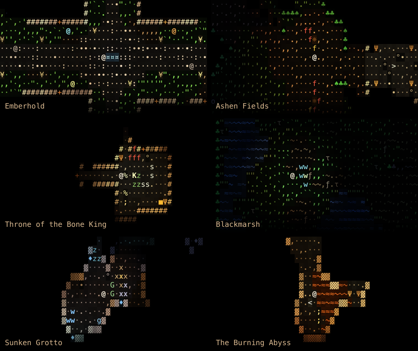

<p align="center"></p>

<h1 align="center">Termablo</h1>

<p align="center"><b>A Diablo-like roguelike for the terminal.</b><br>
Every torch, campfire, crystal, lava pool and spell casts real, colored, flickering light.<br>
You see only what the light reaches.</p>

## Play

Nothing to install:

```sh
ssh medv.io -p 2222
```

Or run it locally:

```sh
go run github.com/antonmedv/termablo@latest
```

Add `-seed 42` and the world is the same every time. Share the seed, race a friend.

<p align="center"></p>

A king once carried a coal up out of the Abyss and built a town around it.
The dark cannot cross light taken from it, so it climbs toward the town
instead. You are the stranger they hire to go down and meet it.

## Host your own

```sh
docker compose up -d        # then: ssh localhost -p 2222
```

or, without Docker:

```sh
go run github.com/antonmedv/termablo@latest -ssh :2222
```

Built with [Bubble Tea](https://github.com/charmbracelet/bubbletea) and [Wish](https://github.com/charmbracelet/wish).

## Balancing

Nobody tuned the numbers by hand. Two scripted players, a fighter and a
caster, play the game to the end over many seeds. How deep they get, what
kills them and what their gold does is held against a set of goals
(`internal/balance`), and every number in the game's formulas is a knob
(`rules.go`) a balance pass may turn.

```sh
make knobs                                  # every knob: value, range, meaning
make eval OUT=balance/runs/a.json SEEDS=96  # both builds over 96 seeds, scored
make eval OUT=balance/runs/b.json SEEDS=96 RULES=try.json   # knobs laid over the defaults
go run ./cmd/balance compare balance/runs/a.json balance/runs/b.json
go run . -bot fighter -seed 7               # watch one run
```

A rules file is a JSON overlay, `{"WakeRange": 12}`. The score is the
weighted distance outside the goals, lower is better; `compare` pairs
the two runs by seed and says whether the difference is noise. Every
decision goes in [`balance/LEDGER.md`](balance/LEDGER.md), every pass
ends in [`balance/REPORT.md`](balance/REPORT.md). In Claude Code,
`/balance` runs the whole loop; the runbook is
[`docs/balancing.md`](docs/balancing.md).

## License

[MIT](LICENSE)
