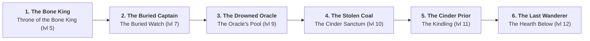

# Quest line

<!-- Generated by `make docs` (TestDocQuests in route_test.go) from the quest table and the route the bot walks; do not edit. -->

| # | Boss or thing | Given by | Paid by | Where | Way |
|---|---|---|---|---|---|
| 1 | The Bone King | Captain Voss | Captain Voss | Throne of the Bone King (lvl 5) | Emberhold (lvl 0) → Ashen Fields (lvl 1) → Crypt of the Fallen 1 (lvl 2) → Crypt of the Fallen 2 (lvl 3) → Crypt of the Fallen 3 (lvl 4) → Throne of the Bone King (lvl 5) |
| 2 | The Buried Captain | Captain Voss | Captain Voss | The Buried Watch (lvl 7) | Throne of the Bone King (lvl 5) → Crypt of the Fallen 3 (lvl 4) → Crypt of the Fallen 2 (lvl 3) → Crypt of the Fallen 1 (lvl 2) → Ashen Fields (lvl 1) → Gravewardens' Barrow 1 (lvl 6) → The Buried Watch (lvl 7) |
| 3 | The Drowned Oracle | Captain Voss | Captain Voss | The Oracle's Pool (lvl 9) | The Buried Watch (lvl 7) → Gravewardens' Barrow 1 (lvl 6) → Ashen Fields (lvl 1) → Blackmarsh (lvl 6) → Sunken Grotto 1 (lvl 7) → Sunken Grotto 2 (lvl 8) → The Oracle's Pool (lvl 9) |
| 4 | The Stolen Coal | Hadrik the Smith | Hadrik the Smith | The Cinder Sanctum (lvl 10) | The Oracle's Pool (lvl 9) → Sunken Grotto 2 (lvl 8) → Sunken Grotto 1 (lvl 7) → Blackmarsh (lvl 6) → Ashen Fields (lvl 1) → Emberhold (lvl 0) → The Cinder Sanctum (lvl 10) |
| 5 | The Cinder Prior | Brother Aldous | Brother Aldous | The Kindling (lvl 11) | The Cinder Sanctum (lvl 10) → The Kindling (lvl 11) |
| 6 | The Last Wanderer | the death of The Drowned Oracle | — | The Hearth Below (lvl 12) | The Kindling (lvl 11) → The Cinder Sanctum (lvl 10) → Emberhold (lvl 0) → Ashen Fields (lvl 1) → Blackmarsh (lvl 6) → Sunken Grotto 1 (lvl 7) → Sunken Grotto 2 (lvl 8) → The Oracle's Pool (lvl 9) → The Burning Abyss 1 (lvl 10) → The Burning Abyss 2 (lvl 11) → The Hearth Below (lvl 12) |
