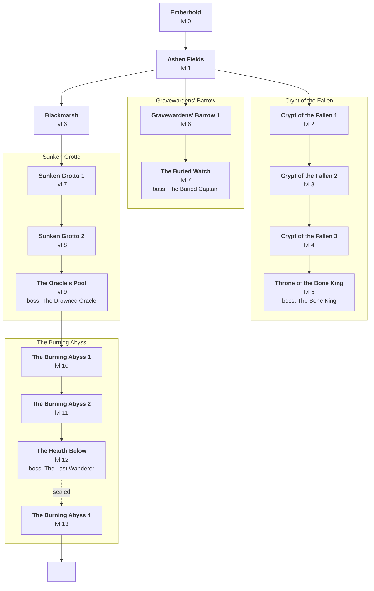
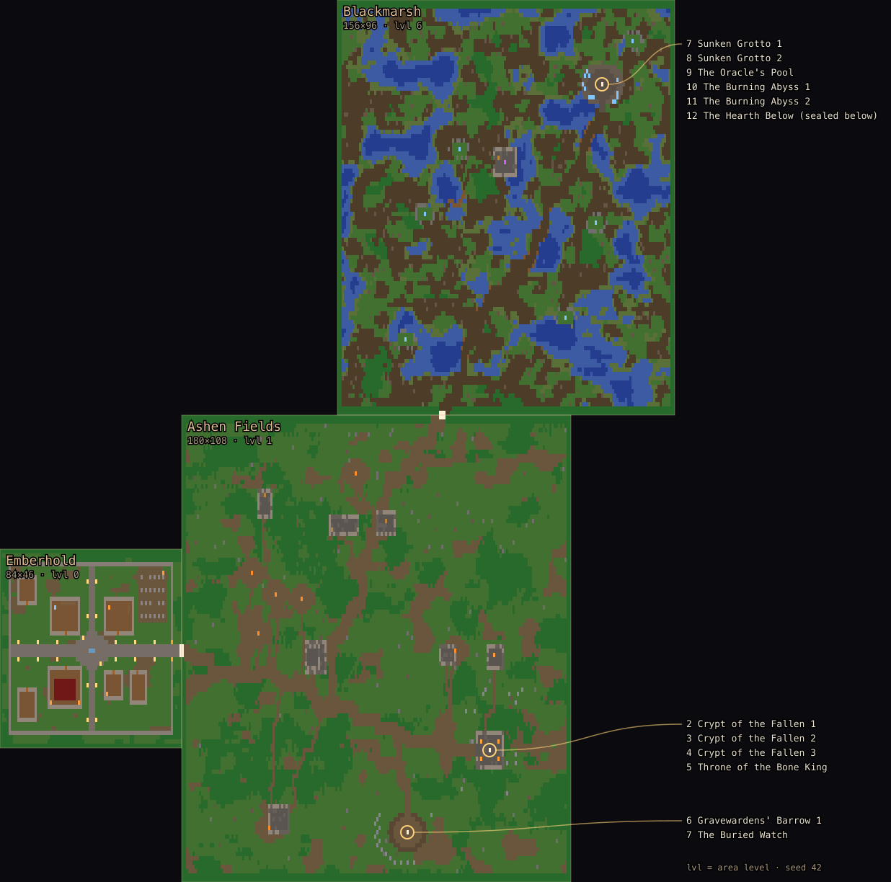

# World map

<!-- Generated by `make world` (TestShotWorld in world_test.go); do not edit. -->

```mermaid
flowchart TD
    town["<b>Emberhold</b><br/>lvl 0"]
    fields["<b>Ashen Fields</b><br/>lvl 1"]
    marsh["<b>Blackmarsh</b><br/>lvl 6"]
    subgraph crypt [Crypt of the Fallen]
        crypt1["<b>Crypt of the Fallen 1</b><br/>lvl 2"]
        crypt2["<b>Crypt of the Fallen 2</b><br/>lvl 3"]
        crypt3["<b>Crypt of the Fallen 3</b><br/>lvl 4"]
        crypt4["<b>Throne of the Bone King</b><br/>lvl 5<br/>boss: The Bone King"]
    end
    subgraph barrow [Gravewardens' Barrow]
        barrow1["<b>Gravewardens' Barrow 1</b><br/>lvl 6"]
        barrow2["<b>The Buried Watch</b><br/>lvl 7<br/>boss: The Buried Captain"]
    end
    subgraph grotto [Sunken Grotto]
        grotto1["<b>Sunken Grotto 1</b><br/>lvl 7"]
        grotto2["<b>Sunken Grotto 2</b><br/>lvl 8"]
        grotto3["<b>The Oracle's Pool</b><br/>lvl 9<br/>boss: The Drowned Oracle"]
    end
    subgraph abyss [The Burning Abyss]
        abyss1["<b>The Burning Abyss 1</b><br/>lvl 10"]
        abyss2["<b>The Burning Abyss 2</b><br/>lvl 11"]
        abyss3["<b>The Hearth Below</b><br/>lvl 12<br/>boss: The Last Wanderer"]
        abyss4["<b>The Burning Abyss 4</b><br/>lvl 13"]
    end
    town --> fields
    fields --> crypt1
    fields --> barrow1
    fields --> marsh
    crypt1 --> crypt2
    barrow1 --> barrow2
    marsh --> grotto1
    crypt2 --> crypt3
    grotto1 --> grotto2
    crypt3 --> crypt4
    grotto2 --> grotto3
    grotto3 --> abyss1
    abyss1 --> abyss2
    abyss2 --> abyss3
    abyss3 -. sealed .-> abyss4
    abyss4 --> abyss4_more["…"]
```

